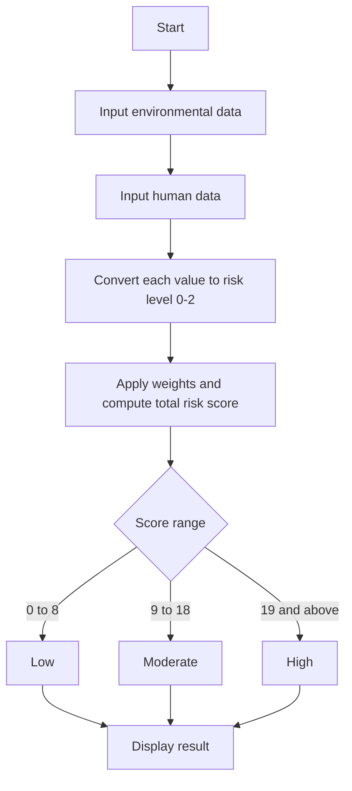

# Environmental Health Risk Assessment System

**Project Report**

| | |
|---|---|
| **Name** | Shourya Vardhan Singh |
| **Registration Number** | 26BAI10727 |
| **Language** | Python 3 |
| **Type** | Console-based, rule-based risk scoring application |

---

## 1. Abstract

This project estimates a person's health risk from the surrounding environment. It takes five environmental readings (temperature, humidity, wind speed, AQI, UV index) and three personal details (age, occupation, existing health condition). Each factor is converted into a risk level of 0, 1 or 2. The levels are combined using a weighted formula into a single score, which is classified as **Low**, **Moderate** or **High** risk.

## 2. Introduction

Air pollution, extreme heat or cold, humidity and UV radiation affect people differently. A child, an elderly person, an outdoor worker, or someone with asthma is more vulnerable than a healthy adult working indoors. This project combines environmental and personal factors into one easy-to-read risk category.

## 3. Objectives

- Collect environmental and personal data from the user.
- Convert each raw value into a standard risk level (0 = safe, 1 = caution, 2 = danger).
- Give more weight to the factors that matter most for health (AQI and existing health condition).
- Produce a final risk category: Low, Moderate or High.

## 4. Tools and Technologies

| Item | Details |
|---|---|
| Language | Python 3 |
| Editor | Visual Studio Code |
| Data structures | Dictionaries, functions, conditional statements |
| Version control | Git / GitHub |

## 5. System Design

### 5.1 Workflow



### 5.2 Data storage

Data is stored in dictionaries:

- `Data_of_Enviorment`: Temperature, AQI, Humidity, Wind Speed, UV Index
- `Data_of_Human`: Age, Occupation, Human Condition
- `risk_Data_of_Enviorment` and `risk_Data_of_Human`: the converted risk levels
- `result`: final score and risk category

## 6. Inputs

| Parameter | Type | Description |
|---|---|---|
| Temperature | float | Temperature in °C |
| Humidity | int | Relative humidity in % |
| Wind Speed | float | Wind speed in km/h |
| AQI | float | Air Quality Index |
| UV Index | int | UV radiation index |
| Age | int | Age in years |
| Occupation | string | `Indoor`, `Mixed` or `Outdoor` |
| Human Condition | string | `nil`, `Asthma`, `respiratory related problems`, or any other condition |

## 7. Risk Level Rules

Each function returns **0** (low risk), **1** (moderate risk) or **2** (high risk).

| Factor | 0 | 1 | 2 |
|---|---|---|---|
| Temperature (°C) | 15 to 30 | below 15 | above 30 |
| Humidity (%) | 30 to 60 | below 30, or above 60 up to 80 | above 80 |
| Wind Speed (km/h) | 0 to 15 | above 15 up to 30 | above 30 |
| AQI | 0 to 50 | 51 to 100 | above 100 |
| UV Index | 0 to 2 | 3 to 5 | above 5 |
| Age (years) | 13 to 59 | 0 to 12, or 60 and above | none |
| Occupation | Indoor (or unrecognised) | Mixed | Outdoor |
| Health Condition | `nil` | any other condition | Asthma, respiratory related problems |

## 8. Scoring Formula

Factors with the greatest health impact are given higher weights:

```
Total Risk = (AQI x 4) + (Temperature x 3) + (Health Condition x 4)
           + (Humidity x 2) + (UV Index x 2)
           + (Wind Speed x 1) + (Occupation x 1) + (Age x 1)
```

| Weight | Factors |
|---|---|
| 4 | AQI, Health Condition |
| 3 | Temperature |
| 2 | Humidity, UV Index |
| 1 | Wind Speed, Occupation, Age |

The maximum possible score is 36.

### Classification

| Total Score | Risk Category |
|---|---|
| 0 to 8 | Low |
| 9 to 18 | Moderate |
| 19 and above | High |

## 9. Source Code

```python
Data_of_Human = {}
Data_of_Enviorment = {}
Data_of_Enviorment["Temperature"] = float(input("Enter Temperature ="))
Data_of_Human["Age"] = int(input("Enter Age ="))
Data_of_Human["Occupation"] = input("Enter occupation = ")
Data_of_Enviorment["AQI"] = float(input("Enter AQI ="))
Data_of_Human["Human Condition"] = input("Enter Human Disease if any =")
Data_of_Enviorment["Humidity"] = int(input("Enter Humidity ="))
Data_of_Enviorment["Wind Speed"] = float(input("Enter wind speed = "))
Data_of_Enviorment["UV Index"] = int(input("Enter UI index ="))
print(Data_of_Enviorment)
print(Data_of_Human)


# Temperature
def temperature(temp):
    if temp < 15:
        return 1
    elif temp <= 30:
        return 0
    else:
        return 2

# Humidity
def humidity(hum):
    if hum < 30:
        return 1
    elif hum >= 30 and hum <= 60:
        return 0
    elif hum > 60 and hum <= 80:
        return 1
    else:
        return 2

# Wind speed
def wind_speed(ws):
    if 0 <= ws <= 15:
        return 0
    elif ws <= 30:
        return 1
    else:
        return 2

# AQI
def AQI(aqi):
    if 0 <= aqi <= 50:
        return 0
    elif aqi <= 100:
        return 1
    else:
        return 2

# UV index
def UV_Index(uv):
    if 0 <= uv <= 2:
        return 0
    elif uv <= 5:
        return 1
    elif uv <= 7:
        return 2
    else:
        return 2

# Age
def age(a):
    if 0 <= a <= 12:
        return 1
    elif a <= 59:
        return 0
    else:
        return 1

# Occupation
def occupation(oc):
    if oc == "Indoor":
        return 0
    elif oc == "Mixed":
        return 1
    elif oc == "Outdoor":
        return 2
    else:
        return 0

# Health condition
def health_condition(hc):
    if hc == "nil":
        return 0
    elif hc == "Asthma":
        return 2
    elif hc == "respiratory related problems":
        return 2
    else:
        return 1


temp_s = temperature(Data_of_Enviorment["Temperature"])
hum_s = humidity(Data_of_Enviorment["Humidity"])
ws_s = wind_speed(Data_of_Enviorment["Wind Speed"])
aqi_s = AQI(Data_of_Enviorment["AQI"])
uv_s = UV_Index(Data_of_Enviorment["UV Index"])
age_s = age(Data_of_Human["Age"])
occupation_s = occupation(Data_of_Human["Occupation"])
health_s = health_condition(Data_of_Human["Human Condition"])

risk_Data_of_Human = {}
risk_Data_of_Enviorment = {}
risk_Data_of_Enviorment["Temperature"] = temp_s
risk_Data_of_Human["Age"] = age_s
risk_Data_of_Human["Occupation"] = occupation_s
risk_Data_of_Enviorment["AQI"] = aqi_s
risk_Data_of_Human["Human Condition"] = health_s
risk_Data_of_Enviorment["Humidity"] = hum_s
risk_Data_of_Enviorment["Wind Speed"] = ws_s
risk_Data_of_Enviorment["UV Index"] = uv_s
print(risk_Data_of_Enviorment)
print(risk_Data_of_Human)

total_risk = (aqi_s*4) + (temp_s*3) + (health_s*4) + (hum_s*2) + (uv_s*2) + (ws_s) + (occupation_s) + (age_s)

result = {}
result["Total risk score"] = total_risk

if 0 <= total_risk <= 8:
    result["Risk"] = "Low"
elif total_risk <= 18:
    result["Risk"] = "Moderate"
else:
    result["Risk"] = "High"

print(result)
```

## 10. Sample Run

**Input**

| Parameter | Value |
|---|---|
| Temperature | 35 |
| Age | 25 |
| Occupation | Outdoor |
| AQI | 150 |
| Human Condition | Asthma |
| Humidity | 70 |
| Wind Speed | 10 |
| UV Index | 8 |

**Risk levels:** Temperature 2, Humidity 1, Wind Speed 0, AQI 2, UV 2, Age 0, Occupation 2, Health 2

**Calculation**

```
Total = (2x4) + (2x3) + (2x4) + (1x2) + (2x2) + 0 + 2 + 0
      = 8 + 6 + 8 + 2 + 4 + 0 + 2 + 0
      = 30
```

**Output**

```
{'Total risk score': 30, 'Risk': 'High'}
```

## 11. Limitations

- The thresholds and weights are chosen by the developer and are not based on clinical data, so the result is an indicative estimate and not medical advice.
- Text inputs are case-sensitive (`Asthma` works, `asthma` is treated as "other condition"). An unrecognised occupation is scored as `Indoor`.
- Input is not validated, so a non-numeric entry for a number field stops the program with an error.
- Values must be entered manually.

## 12. Future Scope

- Fetch live weather, AQI and UV data from an API.
- Validate input and handle case differences with `.strip().lower()`.
- Add more health conditions (heart disease, allergies, diabetes) and give precautions for each risk level.
- Build a GUI or web/mobile interface.
- Tune the weights using real health datasets or machine learning.

## 13. Conclusion

The project shows how environmental and personal factors can be combined into one risk score using functions, dictionaries and weighted arithmetic. It is simple and easy to extend, and it provides a foundation for a more advanced health-alert system.

---

*Submitted by Shourya Vardhan Singh (Reg. No. 26BAI10727)*
